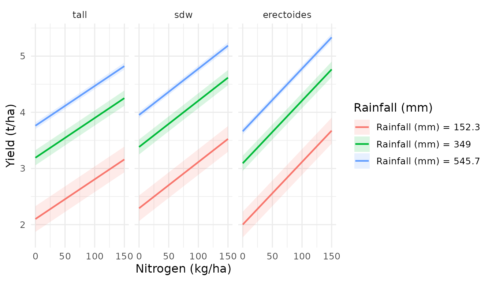

# Visualising Statistical Effects in 3D

## Introduction

Statistical models produce many types of “effects” — predictions,
contrasts, slopes, treatment effects — each answering a different
question. Traditional 2D plots show these effects along one variable at
a time. But when two variables jointly influence an effect, critical
patterns (interaction ridges, saddle points, optimal combinations)
remain hidden.

`effectsurf` visualises five core effect types as interactive 3D
surfaces:

| Effect type                              | Question answered                          | effectsurf function                                                                                                                                                                     |
|------------------------------------------|--------------------------------------------|-----------------------------------------------------------------------------------------------------------------------------------------------------------------------------------------|
| **Predictions**                          | What does the model predict at (x, y)?     | [`surf_prediction()`](https://aagi-aus.github.io/effectsurf/reference/surf_prediction.md)                                                                                               |
| **Marginal effects (slopes)**            | How fast does the outcome change with x?   | [`surf_slopes()`](https://aagi-aus.github.io/effectsurf/reference/surf_slopes.md)                                                                                                       |
| **Treatment contrasts (ATE)**            | What is the average treatment effect?      | [`surf_comparison()`](https://aagi-aus.github.io/effectsurf/reference/surf_comparison.md)                                                                                               |
| **Conditional treatment effects (CATE)** | Where does the treatment work best?        | [`surf_comparison()`](https://aagi-aus.github.io/effectsurf/reference/surf_comparison.md) / [`surf_sensitivity()`](https://aagi-aus.github.io/effectsurf/reference/surf_sensitivity.md) |
| **Interaction effects**                  | Do two factors modify each other’s effect? | `surf_prediction(by = ...)`                                                                                                                                                             |

This vignette demonstrates each type with worked examples.

## Setup

``` r
library(effectsurf)
library(marginaleffects)
data(barley_trials)
```

------------------------------------------------------------------------

## 1. Predictions: What does the model expect?

A **prediction surface** shows the model’s fitted values across a grid
of two continuous variables, with all other variables held at reference
values (mean for numeric, mode for factors). This is the 3D extension of
the classical estimated marginal means (EMMs).

**When to use:** Explore the overall response landscape. Identify where
outcomes are highest/lowest. Compare response shapes between groups.

### Example: Linear model (lm)

A simple linear model with interaction:

``` r
# Linear model: fuel efficiency as a function of weight, horsepower,
# and their interaction
m_lm <- lm(mpg ~ wt * hp + factor(cyl), data = mtcars)

es_pred_lm <- surf_prediction(
  m_lm, x = "wt", y = "hp",
  x_length = 30, y_length = 30,
  labels = list(
    x = "Weight (1000 lbs)", y = "Horsepower",
    z = "Fuel efficiency (mpg)",
    title = "Prediction surface (linear model)"
  )
)
es_pred_lm
```

``` r
# Interactive 3D visualisation
plot(es_pred_lm)
```

The linear model produces a planar surface (possibly tilted by the
interaction term). Compare this with the flexible nonlinear surface from
a GAM:

### Example: GAM (mgcv)

``` r
# GAM: flexible nonlinear response surface
m_gam <- mgcv::gam(mpg ~ s(wt) + s(hp) + factor(cyl), data = mtcars)

es_pred_gam <- surf_prediction(
  m_gam, x = "wt", y = "hp",
  x_length = 30, y_length = 30,
  labels = list(
    x = "Weight (1000 lbs)", y = "Horsepower",
    z = "Fuel efficiency (mpg)",
    title = "Prediction surface (GAM)"
  )
)
es_pred_gam
```

The GAM surface curves nonlinearly — it captures the diminishing effect
of weight at higher horsepower that the linear model misses.

### Example: Agricultural data — yield across nitrogen and rainfall

``` r
# Barley yield model with smooth rainfall effect and nitrogen as linear
m_barley <- mgcv::gam(
  yield ~ s(rainfall, k = 5) + nitrogen + seedrate +
    variety_type + state + nitrogen:variety_type +
    s(trial, bs = "re"),
  data = barley_trials,
  method = "REML"
)

es_barley <- surf_prediction(
  m_barley, x = "nitrogen", y = "rainfall",
  x_length = 30, y_length = 30,
  labels = list(
    x = "Nitrogen applied (kg/ha)",
    y = "April-October rainfall (mm)",
    z = "Grain yield (t/ha)"
  )
)
summary(es_barley)
#> Estimated Marginal Surface (EMS)
#> ================================
#> 
#> Type:     prediction 
#> X var:    nitrogen 
#> Y var:    rainfall 
#> Z var:    yield 
#> Grid:     900  points
#> CI:       TRUE 
#> Transform: none 
#> 
#> Response summary (estimate):
#>   Min:     2.1059 
#>   Median:  3.9342 
#>   Mean:    3.858 
#>   Max:     5.2341 
#> 
#> Model:  gam/glm/lm 
#> N obs:   3240
```

------------------------------------------------------------------------

## 2. Marginal effects (slopes): How sensitive is the outcome?

A **marginal effect** (or **slope**) is the partial derivative of the
predicted outcome with respect to a focal variable:
$$\frac{\partial\widehat{y}}{\partial x_{j}}$$

A **slope surface** shows how this derivative varies across a 2D grid of
moderators. Regions where the slope is steep indicate high sensitivity;
flat regions indicate the outcome barely responds to changes in $x_{j}$.

**When to use:** Identify where a management input (e.g., nitrogen
fertiliser) has the greatest impact. Quantify diminishing returns. Find
the “sweet spot” where intervention is most efficient.

### Example: Where does nitrogen matter most?

``` r
# How does the marginal effect of nitrogen on yield vary
# across rainfall and seed rate?
es_slopes <- surf_slopes(
  m_barley,
  x = "rainfall", y = "seedrate",
  variable = "nitrogen",
  x_length = 25, y_length = 25,
  labels = list(
    x = "April-October rainfall (mm)",
    y = "Seed rate (plants/m\u00b2)",
    z = "Marginal effect of N on yield (t/ha per kg N)",
    title = "Where does nitrogen have the greatest impact?"
  )
)
es_slopes
```

``` r
plot(es_slopes, colourscale = "RdBu")
```

**Interpreting the surface:**

- **Positive values** (warm colours): adding nitrogen increases yield
- **Near zero** (white): nitrogen has little further effect (diminishing
  returns)
- **Negative values** (cool colours): excess nitrogen may reduce yield
- **Higher values at higher rainfall**: rain delivers nitrogen to roots,
  amplifying the N effect

### Example: Slopes from a linear model

For a linear model without interactions, the marginal effect of a
variable is constant across the covariate space — the slope surface is
flat:

``` r
m_lm_noint <- lm(mpg ~ wt + hp + factor(cyl), data = mtcars)

es_slopes_lm <- surf_slopes(
  m_lm_noint,
  x = "wt", y = "hp",
  variable = "wt",
  x_length = 20, y_length = 20,
  labels = list(z = "Marginal effect of weight on mpg")
)
# With no interaction, slope is constant
range(surf_data(es_slopes_lm)$estimate)
#> [1] -3.181404 -3.181404
```

With an interaction, the surface tilts:

``` r
m_lm_int <- lm(mpg ~ wt * hp + factor(cyl), data = mtcars)

es_slopes_int <- surf_slopes(
  m_lm_int,
  x = "wt", y = "hp",
  variable = "wt",
  x_length = 20, y_length = 20,
  labels = list(z = "Marginal effect of weight on mpg")
)
# With interaction, the effect of weight depends on horsepower
range(surf_data(es_slopes_int)$estimate)
#> [1] -6.0608736  0.7173187
```

------------------------------------------------------------------------

## 3. Treatment contrasts (ATE): Does the treatment work?

An **Average Treatment Effect** is the expected difference in outcome
between treatment and control, averaged over the population:
$$\text{ATE} = E\left\lbrack Y(1) \right\rbrack - E\left\lbrack Y(0) \right\rbrack$$

A **contrast surface** shows this difference across a grid of two
moderators.
[`surf_comparison()`](https://aagi-aus.github.io/effectsurf/reference/surf_comparison.md)
uses
[`marginaleffects::comparisons()`](https://rdrr.io/pkg/marginaleffects/man/comparisons.html)
internally, which computes contrasts correctly for any model class.

**When to use:** Quantify treatment benefits. Compare treatment arms.
Identify where treatment effects are strongest (this becomes CATE — see
next section).

### Example: Effect of cylinder count on fuel efficiency

``` r
# What is the effect of having 8 vs 4 cylinders, across wt x hp?
es_ate <- surf_comparison(
  m_lm,
  x = "wt", y = "hp",
  variable = "cyl",
  x_length = 20, y_length = 20,
  labels = list(
    x = "Weight (1000 lbs)", y = "Horsepower",
    z = "Effect on mpg (8 cyl vs reference)",
    title = "ATE: 8 vs 4 cylinders"
  )
)
es_ate
```

``` r
plot(es_ate, colourscale = "RdBu")
```

### Example: Effect of variety type on barley yield

``` r
es_ate_variety <- surf_comparison(
  m_barley,
  x = "nitrogen", y = "rainfall",
  variable = "variety_type",
  x_length = 25, y_length = 25,
  labels = list(
    x = "Nitrogen applied (kg/ha)",
    y = "April-October rainfall (mm)",
    z = "Yield difference (t/ha)",
    title = "Variety type treatment effects"
  )
)
es_ate_variety
```

------------------------------------------------------------------------

## 4. Conditional Average Treatment Effects (CATE): Where does the treatment work best?

The CATE is the ATE conditional on specific covariate values:
$$\text{CATE}\left( x_{1},x_{2} \right) = E\left\lbrack Y(1) - Y(0) \mid X_{1} = x_{1},X_{2} = x_{2} \right\rbrack$$

When the CATE surface is flat, the treatment works equally everywhere.
When it varies, **treatment effect heterogeneity** exists — the
treatment benefits some subgroups more than others.

**When to use:** Precision agriculture (target inputs where they help
most), personalised medicine (who benefits from treatment?), policy
targeting.

[`surf_sensitivity()`](https://aagi-aus.github.io/effectsurf/reference/surf_sensitivity.md)
is a convenience wrapper that frames this as a sensitivity analysis:
“How does the effect of the focal treatment vary across the moderator
space?”

### Example: Where does nitrogen fertiliser help most?

``` r
# The nitrogen "treatment effect" across rainfall x seedrate space
# This answers: under what conditions does adding nitrogen yield the
# greatest return?
es_cate <- surf_sensitivity(
  m_barley,
  x = "rainfall", y = "seedrate",
  focal = "nitrogen",
  focal_contrast = 1,
  x_length = 25, y_length = 25,
  labels = list(
    x = "April-October rainfall (mm)",
    y = "Seed rate (plants/m\u00b2)",
    z = "Yield gain per kg N (t/ha)",
    title = "CATE: nitrogen effect across environment"
  )
)
es_cate
```

``` r
# Red regions: high nitrogen benefit. Blue: low benefit.
plot(es_cate, colourscale = "RdBu")
```

**Key insight:** If the surface shows a strong gradient — e.g., nitrogen
effect is much larger at high rainfall than low rainfall — this directly
informs management: in dry years, reduce N; in wet years, apply more.

### CATE stratified by variety type

``` r
es_cate_strat <- surf_sensitivity(
  m_barley,
  x = "rainfall", y = "seedrate",
  focal = "nitrogen",
  focal_contrast = 1,
  by = "variety_type",
  x_length = 20, y_length = 20,
  labels = list(
    z = "Yield gain per kg N (t/ha)",
    title = "CATE by variety type"
  )
)
es_cate_strat
```

``` r
plot(es_cate_strat, opacity = 0.85)
```

When surfaces separate, varieties respond differently to nitrogen — this
is a genotype-by-management (G x M) interaction visualised in 3D.

------------------------------------------------------------------------

## 5. Interaction effects: Do factors modify each other?

Interaction effects are not a separate “effect type” computed by
`marginaleffects` — they are **visible in the shape** of prediction or
slope surfaces. Two variables interact when the effect of one depends on
the level of the other.

**How to see interactions:**

| Visual pattern                 | Interpretation        |
|--------------------------------|-----------------------|
| Parallel surfaces (stratified) | No interaction        |
| Crossing or diverging surfaces | Interaction present   |
| Twisted/saddle-shaped surface  | Nonlinear interaction |
| Flat slope surface             | No moderating effect  |

### Example: Stratified prediction surfaces reveal interactions

``` r
# If variety types respond differently to nitrogen x rainfall,
# the surfaces will diverge
es_interact <- surf_prediction(
  m_barley,
  x = "nitrogen", y = "rainfall",
  by = "variety_type",
  x_length = 25, y_length = 25,
  labels = list(
    x = "Nitrogen (kg/ha)", y = "Rainfall (mm)",
    z = "Yield (t/ha)",
    title = "G x E x M interaction"
  )
)
```

``` r
plot(es_interact, opacity = 0.85)
```

### Profile projections quantify the interaction

Extract 2D slices to see exactly where surfaces diverge:

``` r
# How do varieties respond to nitrogen at different rainfall levels?
surf_profile(es_interact, along = "x", at = c(150, 350, 550))
```



------------------------------------------------------------------------

## 6. Mixed models (lme4)

``` r
# Mixed model: random intercepts for trial
m_lmer <- lme4::lmer(
  yield ~ nitrogen * variety_type + rainfall + seedrate +
    (1 | trial),
  data = barley_trials
)

es_lmer <- surf_prediction(
  m_lmer,
  x = "nitrogen", y = "rainfall",
  by = "variety_type",
  x_length = 25, y_length = 25,
  labels = list(
    x = "Nitrogen (kg/ha)", y = "Rainfall (mm)",
    z = "Yield (t/ha)",
    title = "Mixed model prediction surface"
  )
)
es_lmer
```

``` r
# Treatment effect from the mixed model
es_lmer_ate <- surf_comparison(
  m_lmer,
  x = "nitrogen", y = "rainfall",
  variable = "variety_type",
  x_length = 20, y_length = 20,
  labels = list(z = "Yield difference (t/ha)")
)
es_lmer_ate
```

------------------------------------------------------------------------

## 7. Generalised linear models (GLM)

For binary or count outcomes, `effectsurf` handles link functions
automatically via `marginaleffects`.

``` r
# Simulate a binary outcome: does yield exceed 3 t/ha?
bt <- barley_trials
bt$high_yield <- as.integer(bt$yield > 3)

m_glm <- glm(
  high_yield ~ nitrogen + rainfall + seedrate + variety_type,
  data = bt, family = binomial
)

# Probability of high yield across nitrogen x rainfall
es_glm <- surf_prediction(
  m_glm,
  x = "nitrogen", y = "rainfall",
  x_length = 25, y_length = 25,
  labels = list(
    x = "Nitrogen (kg/ha)", y = "Rainfall (mm)",
    z = "P(yield > 3 t/ha)",
    title = "Probability surface (logistic regression)"
  )
)
es_glm
```

``` r
plot(es_glm)
```

For GLMs, `marginaleffects` automatically computes predictions on the
response scale (probabilities for logistic regression), so the surface
shows interpretable values without manual back-transformation.

------------------------------------------------------------------------

## 8. Derivative surfaces: sensitivity, curvature, and interaction maps

Traditional analysis asks “what does the model predict?” Derivative
surfaces ask **“how does the prediction change?”** — revealing structure
that is invisible in the prediction surface itself.

[`surf_derivatives()`](https://aagi-aus.github.io/effectsurf/reference/surf_derivatives.md)
computes numerical derivatives from any `effectsurf` object via finite
differences on the grid. No additional model calls are needed. Each
derivative is returned as a standard `effectsurf` object, reusable with
[`plot()`](https://rdrr.io/r/graphics/plot.default.html),
[`surf_contour()`](https://aagi-aus.github.io/effectsurf/reference/surf_contour.md),
[`surf_export()`](https://aagi-aus.github.io/effectsurf/reference/surf_export.md),
etc.

| Derivative         | Notation   | Interpretation                                 |
|--------------------|------------|------------------------------------------------|
| ∂z/∂x              | `dzdx`     | Local sensitivity to x (rate of change)        |
| ∂z/∂y              | `dzdy`     | Local sensitivity to y                         |
| Gradient magnitude | `gradient` | Overall rate of change (steep vs flat)         |
| ∂²z/∂x²            | `d2zdx2`   | Curvature in x (concave = diminishing returns) |
| ∂²z/∂y²            | `d2zdy2`   | Curvature in y                                 |
| ∂²z/∂x∂y           | `d2zdxdy`  | **Local interaction strength** (cross-partial) |

### Example: Where does the yield response curve?

``` r
# Compute all derivatives from the yield prediction surface
derivs <- surf_derivatives(es_barley, order = 2)
names(derivs)
#> [1] "dzdx"     "dzdy"     "gradient" "d2zdx2"   "d2zdy2"   "d2zdxdy"
```

The **gradient magnitude** identifies regions of rapid vs stable
response. Flat regions (low gradient) are near optima or plateaus:

``` r
summary(derivs$gradient)
#> Estimated Marginal Surface (EMS)
#> ================================
#> 
#> Type:     prediction 
#> X var:    nitrogen 
#> Y var:    rainfall 
#> Z var:    gradient_Grain yield (t/ha) 
#> Grid:     900  points
#> CI:       FALSE 
#> Transform: none 
#> 
#> Response summary (estimate):
#>   Min:     0.0083 
#>   Median:  0.0095 
#>   Mean:    0.0093 
#>   Max:     0.0102 
#> 
#> Model:  gam/glm/lm 
#> N obs:   3240
```

The **cross-partial derivative** ∂²z/∂x∂y is particularly informative —
it measures the **spatially-resolved interaction strength** between x
and y. Non-zero values mean the effect of nitrogen depends on rainfall
level (and vice versa) at that specific grid location:

``` r
# Where in the N × Rainfall space do these variables interact?
summary(derivs$d2zdxdy)
#> Estimated Marginal Surface (EMS)
#> ================================
#> 
#> Type:     prediction 
#> X var:    nitrogen 
#> Y var:    rainfall 
#> Z var:    d2_Grain yield (t/ha)_d_Nitrogen applied (kg/ha)_d_April-October rainfall (mm) 
#> Grid:     900  points
#> CI:       FALSE 
#> Transform: none 
#> 
#> Response summary (estimate):
#>   Min:     0 
#>   Median:  0 
#>   Mean:    0 
#>   Max:     0 
#> 
#> Model:  gam/glm/lm 
#> N obs:   3240
```

``` r
# 3D interaction map
plot(derivs$d2zdxdy)

# 2D contour of curvature in nitrogen
surf_contour(derivs$d2zdx2, interactive = FALSE)
```

**Key scientific applications:**

- **Agronomic optimisation:** ∂z/∂x → 0 marks the optimal nitrogen rate.
  ∂²z/∂x² \< 0 confirms it is a maximum (diminishing returns).
- **Interaction localisation:** The cross-partial ∂²z/∂x∂y reveals WHERE
  in the covariate space two variables interact, not just WHETHER. This
  goes beyond a single interaction p-value.
- **Stability assessment:** Regions with small gradient magnitude
  indicate stable zones where small input changes have minimal effect on
  outcome.

### Derivative surfaces work with any effect type

[`surf_derivatives()`](https://aagi-aus.github.io/effectsurf/reference/surf_derivatives.md)
accepts the output of
[`surf_prediction()`](https://aagi-aus.github.io/effectsurf/reference/surf_prediction.md),
[`surf_slopes()`](https://aagi-aus.github.io/effectsurf/reference/surf_slopes.md),
[`surf_comparison()`](https://aagi-aus.github.io/effectsurf/reference/surf_comparison.md),
[`surf_cate()`](https://aagi-aus.github.io/effectsurf/reference/surf_cate.md),
etc.:

``` r
# Derivative of the slope surface = second-order sensitivity
slope_derivs <- surf_derivatives(es_slopes, order = 1)
summary(slope_derivs$gradient)
#> Estimated Marginal Surface (EMS)
#> ================================
#> 
#> Type:     prediction 
#> X var:    rainfall 
#> Y var:    seedrate 
#> Z var:    gradient_Marginal effect of N on yield (t/ha per kg N) 
#> Grid:     625  points
#> CI:       FALSE 
#> Transform: none 
#> 
#> Response summary (estimate):
#>   Min:     0 
#>   Median:  0 
#>   Mean:    0 
#>   Max:     0 
#> 
#> Model:  gam/glm/lm 
#> N obs:   3240
```

------------------------------------------------------------------------

## 9. Post-prediction smoothing: Smooth surfaces from non-smooth models

Models like random forests, boosted trees, or MARS produce **jagged or
step-function prediction surfaces**. While the predictions are valid,
the 3D visualisation can be difficult to interpret because of staircase
artefacts.

The `smooth` parameter applies a
[`mgcv::gam()`](https://rdrr.io/pkg/mgcv/man/gam.html) tensor product
smooth (`te(x, y)`) to the predicted values **after** prediction. This
is a **visual approximation** — the original model is never re-fitted.
The smooth surrogate captures the overall surface trend while removing
discontinuities.

### How it works

``` r
# Step 1: model predicts on grid → jagged surface (e.g., from ranger)
# Step 2: mgcv::gam(estimate ~ te(x, y, k, bs)) fitted to predictions
# Step 3: smooth surface replaces raw predictions for visualisation
```

When `by` is set (stratified surfaces), **a separate smooth is fitted
per stratum**, preserving any interaction structure across groups.

### Usage

``` r
# Auto-smooth (k = -1, same as mgcv::s() default)
es <- surf_prediction(model, x = "x1", y = "x2", smooth = TRUE)

# Custom: higher k preserves more detail
es <- surf_prediction(model, x = "x1", y = "x2",
                      smooth = list(k = 20, bs = "tp"))

# Don't smooth the CI bands (only smooth the estimate)
es <- surf_prediction(model, x = "x1", y = "x2",
                      smooth = list(smooth_ci = FALSE))
```

### Example: Smoothing a linear model’s prediction surface

``` r
# Even a linear model shows a subtle difference when re-smoothed,
# because te(x, y) allows for nonlinear fits to the predicted values
es_raw <- surf_prediction(
  m_lm, x = "wt", y = "hp", x_length = 25, y_length = 25
)
es_smooth <- surf_prediction(
  m_lm, x = "wt", y = "hp", x_length = 25, y_length = 25,
  smooth = TRUE
)

# Compare ranges
cat("Raw:     ", range(surf_data(es_raw)$estimate), "\n")
#> Raw:      7.63559 31.33967
cat("Smoothed:", range(surf_data(es_smooth)$estimate), "\n")
#> Smoothed: 7.63559 31.33967
```

### Key considerations

| Aspect                    | Detail                                                                                   |
|---------------------------|------------------------------------------------------------------------------------------|
| **When to use**           | Random forests, boosted trees, MARS, any non-smooth model                                |
| **When NOT to use**       | GAMs, linear models (already smooth)                                                     |
| **Basis dimension** (`k`) | Higher = more detail preserved; lower = more smoothing                                   |
| **Default**               | `k = -1` (mgcv auto-selects, same as [`mgcv::s()`](https://rdrr.io/pkg/mgcv/man/s.html)) |
| **CI smoothing**          | Enabled by default; set `smooth_ci = FALSE` to preserve raw CIs                          |
| **Traceability**          | Smooth options stored in `es_meta(es)$meta$smooth`                                       |

**Important:** Smoothed surfaces are approximate. A `cli` message is
printed whenever smoothing is applied. For publications, always note
that post-prediction smoothing was used.

------------------------------------------------------------------------

## Summary: Choosing the right effect surface

| Your question                                     | Effect type     | Function                                                                                    |
|---------------------------------------------------|-----------------|---------------------------------------------------------------------------------------------|
| What is the predicted outcome?                    | Prediction      | [`surf_prediction()`](https://aagi-aus.github.io/effectsurf/reference/surf_prediction.md)   |
| How much does the outcome change per unit of X?   | Marginal effect | [`surf_slopes()`](https://aagi-aus.github.io/effectsurf/reference/surf_slopes.md)           |
| What is the difference between treatment groups?  | ATE contrast    | [`surf_comparison()`](https://aagi-aus.github.io/effectsurf/reference/surf_comparison.md)   |
| Does the treatment effect vary across conditions? | CATE            | [`surf_sensitivity()`](https://aagi-aus.github.io/effectsurf/reference/surf_sensitivity.md) |
| Do two variables interact?                        | Interaction     | `surf_prediction(by = ...)`                                                                 |
| Where does the response curve/flatten?            | Curvature       | `surf_derivatives(order = 2)`                                                               |
| Where do variables interact locally?              | Cross-partial   | `surf_derivatives()$d2zdxdy`                                                                |
| Which combination of inputs is optimal?           | Optimum         | [`surf_optimum()`](https://aagi-aus.github.io/effectsurf/reference/surf_optimum.md)         |

All functions return `effectsurf` objects that can be:

- **Plotted** interactively: `plot(es)`
- **Projected** to 2D: `surf_profile(es)`
- **Contoured**: `surf_contour(es)`
- **Differentiated**: `surf_derivatives(es)`
- **Exported** to HTML: `surf_export(es, "file.html")`
- **Extracted** as data: `surf_data(es)`
