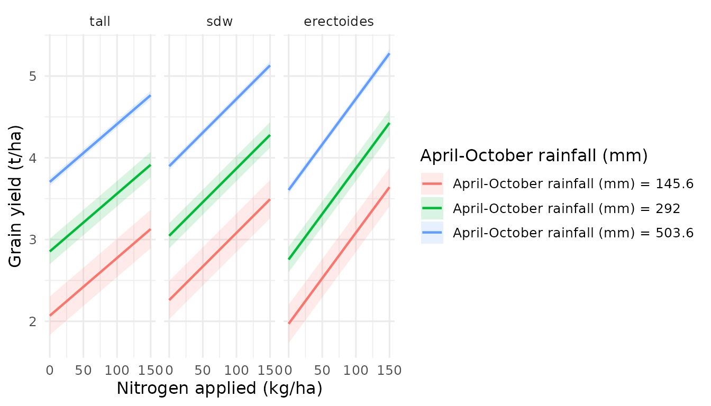

# Getting Started with effectsurf

## What are Estimated Marginal Surfaces (EMS)?

Traditional Estimated Marginal Means (EMMs) show how a predicted outcome
changes along **one** variable at a time. This is a 1D slice of a
potentially complex response landscape. When two variables interact,
these 1D slices can miss critical patterns — saddle points, interaction
ridges, and optimal management combinations that only become visible in
3D.

**Estimated Marginal Surfaces (EMS)** extend EMMs to **two** continuous
variables simultaneously, producing interactive 3D surfaces. Non-focal
variables are marginalised (held at mean/mode), just as with EMMs.

The `effectsurf` package makes this workflow model-agnostic and requires
as few as **three lines of code**.

## Installation

``` r
# Install from local source (during development)
install.packages("effectsurf", repos = NULL, type = "source")
```

## Quick start: three lines to a 3D surface

``` r
library(effectsurf)
library(mgcv)
#> Loading required package: nlme
#> This is mgcv 1.9-4. For overview type '?mgcv'.

# 1. Fit a model
model <- gam(mpg ~ s(wt) + s(hp) + factor(cyl), data = mtcars)

# 2. Create the prediction surface
es <- surf_prediction(model, x = "wt", y = "hp",
                      x_length = 30, y_length = 30)

# 3. Inspect the object
es
#> ℹ <effectsurf> — Prediction Surface
#> • X: wt | Y: hp | Z: mpg
#> • Grid: 900 points (900 per stratum)
#> • CI: TRUE | Transform: FALSE
#> ℹ Use `plot()` to visualise, `surf_data()` to extract data.
```

To visualise interactively (opens in your browser or RStudio Viewer):

``` r
plot(es)
```

## Stratified surfaces: comparing groups in 3D

When you supply a `by` argument, each level of the categorical variable
produces its own surface, overlaid with distinct colours:

``` r
es_strat <- surf_prediction(
  model, x = "wt", y = "hp", by = "cyl",
  x_length = 25, y_length = 25
)
es_strat
#> ℹ <effectsurf> — Prediction Surface
#> • X: wt | Y: hp | Z: mpg
#> • Grid: 625 points (625 per stratum)
#> • Stratified by: cyl (1 levels)
#> • CI: TRUE | Transform: FALSE
#> ℹ Use `plot()` to visualise, `surf_data()` to extract data.
```

``` r
plot(es_strat, opacity = 0.85)
```

The colourblind-safe palette (Wong, 2011) ensures accessibility. Each
surface can be toggled on/off via the legend.

## Using the bundled barley trials dataset

`effectsurf` ships with `barley_trials` — a simulated dataset based on
patterns from Australian national barley agronomy trials:

``` r
data(barley_trials)
str(barley_trials)
#> 'data.frame':    3240 obs. of  18 variables:
#>  $ yield        : num  3.37 3.75 3.72 4.08 3.93 3.48 4.06 3.89 3.86 4.23 ...
#>  $ protein      : num  13.9 13.4 13.1 13 13.5 13.9 12.3 13 13.2 12.9 ...
#>  $ protein_yield: num  0.467 0.504 0.486 0.532 0.532 0.483 0.499 0.507 0.509 0.545 ...
#>  $ hectolitre   : num  70.4 69.9 70.9 69.7 70.7 70.2 69.8 70.4 70.1 70.4 ...
#>  $ screenings   : num  1.7 3.3 2.5 0.5 0.5 3.7 0.5 2.6 0.5 2.5 ...
#>  $ retention    : num  83.4 90.9 86.6 88.4 85.8 87.1 85.6 87.6 87.5 84.8 ...
#>  $ avgrainwt    : num  40.3 46.8 46.1 48 49.4 48.1 46.7 43.9 45.8 44.7 ...
#>  $ grains_m2    : num  84876 80289 82118 85821 79825 ...
#>  $ nitrogen     : num  0 0 0 0 0 0 0 0 0 20 ...
#>  $ seedrate     : num  75 75 75 150 150 150 300 300 300 75 ...
#>  $ rainfall     : num  508 522 523 522 537 514 506 531 507 554 ...
#>  $ sow_doy      : int  163 163 161 162 161 162 163 160 161 162 ...
#>  $ variety      : Factor w/ 5 levels "Bass","Buloke",..: 1 1 1 1 1 1 1 1 1 1 ...
#>  $ variety_type : Factor w/ 3 levels "tall","sdw","erectoides": 2 2 2 2 2 2 2 2 2 2 ...
#>  $ state        : Factor w/ 3 levels "WA","VIC","NSW": 1 1 1 1 1 1 1 1 1 1 ...
#>  $ trial        : Factor w/ 20 levels "T01","T02","T03",..: 1 1 1 1 1 1 1 1 1 1 ...
#>  $ year         : int  2010 2010 2010 2010 2010 2010 2010 2010 2010 2010 ...
#>  $ rep          : Factor w/ 3 levels "1","2","3": 1 2 3 1 2 3 1 2 3 1 ...

# Fit a GAM with smooth terms and variety type stratification
barley_model <- gam(
  yield ~ s(rainfall, k = 5) +
    nitrogen + seedrate + variety_type + state +
    nitrogen:variety_type +
    s(trial, bs = "re"),
  data = barley_trials,
  method = "REML"
)

summary(barley_model)$r.sq
#> [1] 0.9343002
```

``` r
# Create yield response surface: nitrogen x rainfall, by variety type
es_barley <- surf_prediction(
  barley_model,
  x = "nitrogen", y = "rainfall",
  by = "variety_type",
  x_length = 30, y_length = 30,
  labels = list(
    x = "Nitrogen applied (kg/ha)",
    y = "April-October rainfall (mm)",
    z = "Grain yield (t/ha)",
    title = "Yield response by variety type"
  )
)
es_barley
#> ℹ <effectsurf> — Prediction Surface
#> • X: nitrogen | Y: rainfall | Z: yield
#> • Grid: 2700 points (900 per stratum)
#> • Stratified by: variety_type (3 levels)
#> • CI: TRUE | Transform: FALSE
#> ℹ Use `plot()` to visualise, `surf_data()` to extract data.
```

``` r
plot(es_barley, opacity = 0.85)
```

## 2D profile projections

Extract publication-ready 2D slices from the 3D surface using
[`surf_profile()`](https://aagi-aus.github.io/effectsurf/reference/surf_profile.md):

``` r
# How does yield change with nitrogen at different rainfall levels?
surf_profile(es_barley, along = "x", at = c(150, 300, 500))
```



## Finding the surface optimum

``` r
surf_optimum(es_barley, type = "max")
#> ℹ Surface max found:
#> • nitrogen = 150, 150, and 150
#> • rainfall = 585, 585, and 585
#> • estimate = 4.8689, 5.2341, and 5.3814
#>    variety_type nitrogen rainfall estimate conf.low conf.high
#>          <fctr>    <num>    <num>    <num>    <num>     <num>
#> 1:         tall      150      585 4.868877 4.770190  4.967564
#> 2:          sdw      150      585 5.234114 5.136071  5.332158
#> 3:   erectoides      150      585 5.381396 5.281496  5.481295
```

## Exporting to HTML

Save a self-contained interactive HTML file for sharing:

``` r
surf_export(es_barley, path = "barley_yield_surface.html")
```

## Summary of key functions

| Function                                                                                    | Purpose                               |
|---------------------------------------------------------------------------------------------|---------------------------------------|
| [`surf_prediction()`](https://aagi-aus.github.io/effectsurf/reference/surf_prediction.md)   | 3D prediction surface                 |
| [`surf_comparison()`](https://aagi-aus.github.io/effectsurf/reference/surf_comparison.md)   | Treatment effect difference surface   |
| [`surf_slopes()`](https://aagi-aus.github.io/effectsurf/reference/surf_slopes.md)           | Marginal effect (derivative) surface  |
| [`surf_cate()`](https://aagi-aus.github.io/effectsurf/reference/surf_cate.md)               | CATE surface for causal models        |
| [`surf_profile()`](https://aagi-aus.github.io/effectsurf/reference/surf_profile.md)         | 2D profile projections                |
| [`surf_contour()`](https://aagi-aus.github.io/effectsurf/reference/surf_contour.md)         | 2D contour/heatmap                    |
| [`surf_sensitivity()`](https://aagi-aus.github.io/effectsurf/reference/surf_sensitivity.md) | Treatment effect landscape            |
| [`surf_optimum()`](https://aagi-aus.github.io/effectsurf/reference/surf_optimum.md)         | Surface maximum/minimum               |
| [`surf_compare()`](https://aagi-aus.github.io/effectsurf/reference/surf_compare.md)         | Model comparison (difference) surface |
| [`surf_export()`](https://aagi-aus.github.io/effectsurf/reference/surf_export.md)           | Export to self-contained HTML         |

## Next steps

- **Vignette 2**: Stratified Surfaces — comparing groups in 3D
- **Vignette 3**: Treatment Effects in 3D — from effect sizes to CATE
- **Vignette 4**: Model-Agnostic Surfaces — GAMs, mixed models, and ML
