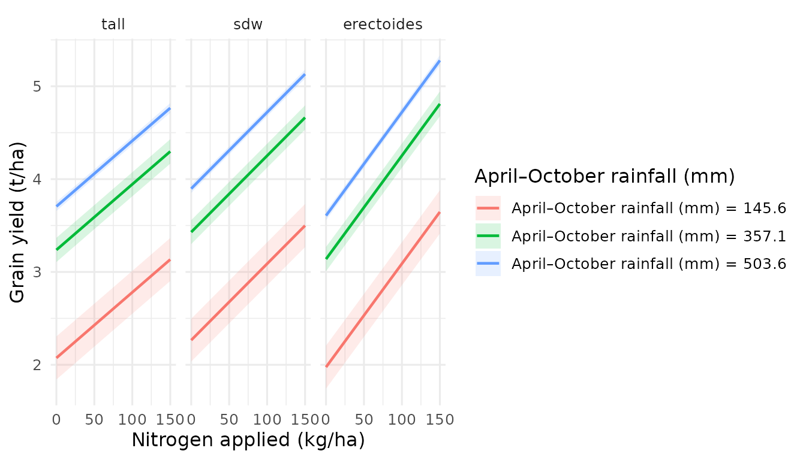
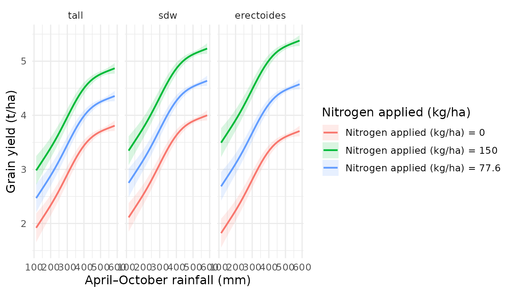

# Stratified Surfaces — Comparing Groups in 3D

## Introduction

A single prediction surface shows how the response changes across two
continuous variables. But what if different **groups** — varieties,
treatments, patient cohorts — respond differently to those same
variables? Are the surfaces parallel, diverging, or crossing?

**Stratified surfaces** answer this question by overlaying multiple
coloured surfaces in a single 3D plot. Each surface represents one level
of a categorical variable. The visual comparison is immediate: where
surfaces separate, groups differ; where they cross, the “best” group
changes.

This vignette demonstrates how to create, customise, and interpret
stratified surfaces with `effectsurf`.

## The `by` parameter

The key to stratified surfaces is the `by` argument in
[`surf_prediction()`](https://aagi-aus.github.io/effectsurf/reference/surf_prediction.md).
When you supply `by = "group"`, `effectsurf` generates a separate
prediction surface for each level of that categorical variable, holding
all other non-focal variables at their marginalised values (mean for
numeric, mode for factors).

``` r
es <- surf_prediction(model, x = "var1", y = "var2", by = "group")
```

Each surface is rendered in a distinct colourblind-safe colour (Wong,
2011) and can be toggled on/off via the interactive legend.

## Example 1: mtcars by cylinder count

We start with a simple example using the built-in `mtcars` dataset. The
question: does the joint effect of weight (`wt`) and horsepower (`hp`)
on fuel economy (`mpg`) differ across engine configurations (4-, 6-, and
8-cylinder)?

``` r
library(effectsurf)
library(mgcv)

# Fit a GAM with cylinder count as a factor
model_mtcars <- gam(
  mpg ~ s(wt) + s(hp) + factor(cyl),
  data = mtcars
)

summary(model_mtcars)$r.sq
#> [1] 0.8690723
```

Now create the stratified surface:

``` r
es_cyl <- surf_prediction(
  model_mtcars,
  x = "wt", y = "hp",
  by = "cyl",
  x_length = 30, y_length = 30,
  labels = list(
    x = "Weight (1000 lbs)",
    y = "Horsepower",
    z = "MPG",
    title = "Fuel economy by cylinder count"
  )
)
es_cyl
```

The printed output shows three strata (4, 6, 8 cylinders), each with its
own prediction grid and summary statistics.

To visualise interactively (opens in your browser or RStudio Viewer):

``` r
plot(es_cyl)
```

The three surfaces should appear vertically offset — 4-cylinder cars
achieve higher MPG at any given weight and horsepower combination, with
8-cylinder cars lowest. The surfaces are roughly parallel, suggesting
the cylinder-count effect is largely additive (no strong interaction
with `wt` or `hp`).

## Example 2: Barley yield by variety type

For a more realistic example, we use the bundled `barley_trials` dataset
— simulated data inspired by Australian national barley agronomy trials.
The question: do different variety types (tall, semi-dwarf, erectoides)
respond differently to the joint effects of nitrogen fertiliser and
growing-season rainfall?

``` r
data(barley_trials)

barley_model <- gam(
  yield ~ s(rainfall, k = 5) +
    nitrogen + seedrate + variety_type +
    nitrogen:variety_type +
    s(trial, bs = "re"),
  data = barley_trials,
  method = "REML"
)

summary(barley_model)$r.sq
#> [1] 0.9343014
```

Create the stratified surface:

``` r
es_barley <- surf_prediction(
  barley_model,
  x = "nitrogen", y = "rainfall",
  by = "variety_type",
  x_length = 30, y_length = 30,
  labels = list(
    x = "Nitrogen applied (kg/ha)",
    y = "April\u2013October rainfall (mm)",
    z = "Grain yield (t/ha)",
    title = "Yield response by variety type"
  )
)
es_barley
```

``` r
plot(es_barley, opacity = 0.85)
```

In the interactive plot you should observe that the surfaces **diverge**
as nitrogen increases — erectoides varieties are more responsive to
nitrogen than tall or semi-dwarf types. This reflects the
nitrogen-by-variety-type interaction built into the model.

## Subsetting strata with `levels_needed`

When a categorical variable has many levels, overlaying all of them
becomes cluttered. The `levels_needed` argument lets you select a subset
of levels to visualise:

``` r
es_subset <- surf_prediction(
  barley_model,
  x = "nitrogen", y = "rainfall",
  by = "variety_type",
  levels_needed = c("tall", "sdw"),
  x_length = 30, y_length = 30,
  labels = list(
    x = "Nitrogen applied (kg/ha)",
    y = "April\u2013October rainfall (mm)",
    z = "Grain yield (t/ha)",
    title = "Tall vs. semi-dwarf varieties"
  )
)
es_subset
```

``` r
plot(es_subset, opacity = 0.85)
```

With only two surfaces, it is much easier to pinpoint exactly where and
by how much they diverge.

## Controlling visual clarity

When overlaying multiple semi-transparent surfaces, small adjustments to
the rendering options can make a large difference.

**Opacity.** The default of 0.85 works well for 2–3 surfaces. Increase
to 0.9–0.95 for dense overlays where you need surfaces to stand out;
decrease to 0.6–0.7 if you want to see through the top surface to those
below:

``` r
plot(es_barley, opacity = 0.9)
```

**Wireframe.** For publication or when colour printing is unavailable,
wireframe mode replaces filled surfaces with a mesh. This avoids
transparency artefacts entirely:

``` r
plot(es_barley, wireframe = TRUE)
```

**Legend.** In the interactive viewer, clicking a stratum name in the
legend toggles that surface on or off. Double-clicking isolates a single
surface. This is invaluable for pairwise comparisons within a
multi-group plot.

## Profile projections from stratified surfaces

Interactive 3D plots are excellent for exploration, but publications and
reports require 2D figures.
[`surf_profile()`](https://aagi-aus.github.io/effectsurf/reference/surf_profile.md)
extracts slices from the surface at fixed values of one variable,
producing publication-ready `ggplot2` line plots.

For stratified surfaces, each slice is **faceted by stratum**, making
group comparisons straightforward:

``` r
# How does yield change with nitrogen at three rainfall levels?
surf_profile(es_barley, along = "x", at = c(150, 350, 500))
```



The panels show the nitrogen–yield relationship for each variety type,
at low (150 mm), moderate (350 mm), and high (500 mm) rainfall. You can
read off:

- Which variety type achieves the highest yield at each rainfall level.
- Whether nitrogen response curves differ across groups (interaction).
- The rainfall threshold above which nitrogen application becomes
  economically worthwhile.

You can also slice along the y-axis to examine the rainfall response at
fixed nitrogen rates:

``` r
surf_profile(es_barley, along = "y", at = c(0, 80, 150))
```



## Interpreting stratified surfaces

The spatial relationship between overlaid surfaces tells a clear story
about group-by-variable interactions:

| Surface pattern    | Interpretation                                                                |
|--------------------|-------------------------------------------------------------------------------|
| Parallel surfaces  | No interaction — groups differ by a constant offset                           |
| Diverging surfaces | Quantitative interaction — one group is more responsive                       |
| Crossing surfaces  | Qualitative interaction — the “best” group changes across the predictor space |

**Parallel surfaces** mean the categorical variable has an additive
effect. The group difference is the same regardless of where you stand
on the x–y plane. The `mtcars` cylinder example approximates this.

**Diverging surfaces** indicate that one group benefits more (or less)
from changes in x or y. The barley example shows divergence along the
nitrogen axis: erectoides varieties gain more yield per unit of
nitrogen.

**Crossing surfaces** are the most practically important. They signal
that the optimal group depends on the combination of x and y values. For
instance, if variety A out-yields variety B at low rainfall but variety
B overtakes at high rainfall, management recommendations must be
site-specific.

## Finding group-specific optima

[`surf_optimum()`](https://aagi-aus.github.io/effectsurf/reference/surf_optimum.md)
locates the x–y combination that maximises (or minimises) the predicted
response. For stratified surfaces, it reports the optimum **separately
for each stratum**:

``` r
surf_optimum(es_barley, type = "max")
#>    variety_type nitrogen rainfall estimate conf.low conf.high
#>          <fctr>    <num>    <num>    <num>    <num>     <num>
#> 1:         tall      150      585 4.868074 4.769478  4.966671
#> 2:          sdw      150      585 5.233336 5.135384  5.331288
#> 3:   erectoides      150      585 5.380613 5.280795  5.480430
```

This immediately reveals whether the optimal management combination
(e.g., nitrogen rate and target rainfall environment) differs across
variety types. If optima diverge substantially, management should be
tailored to the variety.

For the minimum (e.g., identifying the worst-case scenario):

``` r
surf_optimum(es_barley, type = "min")
#>    variety_type nitrogen rainfall estimate conf.low conf.high
#>          <fctr>    <num>    <num>    <num>    <num>     <num>
#> 1:         tall        0      113 1.920255 1.653219  2.187291
#> 2:          sdw        0      113 2.112014 1.846541  2.377488
#> 3:   erectoides        0      113 1.821368 1.554635  2.088101
```

## Exporting stratified surfaces

Save the interactive visualisation as a self-contained HTML file for
sharing with collaborators who do not have R installed:

``` r
surf_export(es_barley, path = "barley_stratified_surface.html")
```

The exported file is fully portable — open it in any modern web browser
to rotate, zoom, and toggle strata. No server or R session is required.

## Summary

| Task                      | Function / argument                            |
|---------------------------|------------------------------------------------|
| Create stratified surface | `surf_prediction(..., by = "group")`           |
| Subset levels             | `surf_prediction(..., levels_needed = c(...))` |
| Adjust opacity            | `plot(es, opacity = 0.9)`                      |
| Wireframe mode            | `plot(es, wireframe = TRUE)`                   |
| 2D profile slices         | `surf_profile(es, along = "x", at = ...)`      |
| Group-specific optima     | `surf_optimum(es, type = "max")`               |
| Export to HTML            | `surf_export(es, path = "file.html")`          |

## Next steps

- **Vignette 3**: Treatment Effects in 3D — from effect sizes to CATE
- **Vignette 4**: Model-Agnostic Surfaces — GAMs, mixed models, and ML
